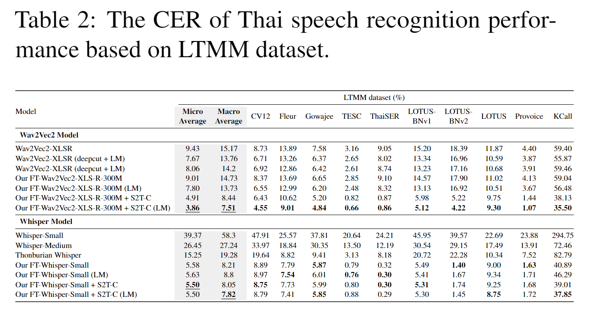

# Large Thai Multi-domain Multi-environment
This repository contains the experimental setup described in the Speech-to-Text Cartography paper. We provide a list of 10 data sources used for Thai speech recognition, which are divided into three sets based on the original public datasets. Totally, the LTMM dataset contains 381.98 hours of speech in the final version (public+private), with 336.75 hours for the public dataset and 45.23 hours for the private dataset, as around 88.16% and 11.84%, respectively.

## List of Dataset Sources
| Dataset | Description | Domain | Environment | Link |
| --- | --- | --- | --- | --- |
| Common Voice 12 (CV12) | A crowd-sourced, open-licensed dataset where speakers record text from Wikipedia in various languages. | Wikipedia (General) | Open | [Link](https://commonvoice.mozilla.org/th/datasets) |
| Fleur | A dataset with real noise recordings in 102 languages. It consists of audio recordings from various speakers, covering a wide range of speaking styles, topics, and environments. | News broadcasts, interviews, podcasts, lectures, conversations, and more. | Open and Real-world | [Link](https://huggingface.co/datasets/google/fleurs/viewer/th_th/train) |
| Gowajee | A dataset of recording input command voices spoken into a microphone for ordering smart devices. The recording environment varied over the years, with a uni-directional microphone used initially and uncontrolled microphones in later years. The recording location is not fixed, introducing uncontrolled environmental factors. | Smart-device | Semi-open | [Link](https://github.com/ekapolc/gowajee_corpus) |
| Thai Elderly Speech Command (TESC) | A dataset of recording input command voices spoken into a microphone by elder speaker for ordering smart devices. | Smart-device | Close | [Link](https://github.com/VISAI-DATAWOW/Thai-Elderly-Speech-dataset/releases/tag/v1.0.0) |
| Thai Speech Emotion Dataset (ThaiSER) | A dataset of recorded speech conversations in different scenarios, including studio and virtual meeting environments. | Conversation | Close (Studio and Virtual Meeting) | [Link](https://github.com/vistec-AI/dataset-releases/releases/tag/v1) |
| Thai News Speech Recognition Corpus (LOTUS-BNv1) | A Thai television broadcast news corpus. It includes audio recordings, transcriptions, and detailed annotations of broadcast news data, such as acoustic conditions, overlapping speech, news topics, and named entities. | Broadcast news | Close (Studio and Telephone) | [Link](https://nectec.or.th/corpus/index.php) |
| Thai News Speech Recognition Corpus (LOTUS-BNv2) | A Thai television broadcast news corpus. It includes audio recordings, transcriptions, and detailed annotations of broadcast news data, such as acoustic conditions, overlapping speech, news topics, and named entities. | Broadcast news | Close (Studio and Telephone) | [Link](https://aiforthai.in.th/corpus.php) |
| Thai Speech Recognition Corpus from NECTEC (LOTUS) | A Thai speech recognition corpus with acoustic details such as phonetics. The transcription distribution is also similar to daily used context (ORCHID corpus in this case). | General | Close (Clean and Noise) | [Link1](https://aiforthai.in.th/corpus.php) [Link2](https://github.com/korakot/corpus/releases/download/v1.0/AIFORTHAI-LotusCorpus.zip) |


## Resample Audio Command
```
ffmpeg -i <audio_path_input> -ac 1 -ar 16000 -o <audio_path_output>
```

## Dataset Splitting
In our experiment, we collected 10 datasets as part of LTMM. Each dataset provides a final version with successful validation, already divided into train, validate, and test sets. However, the CV12 dataset, although validated by humans, is relatively small compared to the full validation set. To address this, we utilized [TH_CV_script (CV_prepro)](CV_prepro) to expand the size of the CV12 dataset and improve its performance with Thai native script. This script incorporates [TH_Re-validation (clean_common_voice.ipynb)](CV_prepro/clean_common_voice.ipynb) for re-validation and [spell_correction](CV_prepro/spell_correction.py) for Thai normalization in CV12.

For the other datasets, we only applied Thai normalization while following the original splitting provided by each dataset.

## Normal Fine-tuning
We recommend these scripts to start fine-tuning the ASR with LTMM; [Wav2Vec2](https://huggingface.co/blog/fine-tune-xlsr-wav2vec2), [Whisper](https://huggingface.co/blog/fine-tune-whisper).

## The Access of Private Dataset
Currently, the private datasets are not included in this version due to privacy concerns and legal regulations in Thailand. However, we have plans to develop new datasets following the same criteria as ProVoice and KCall in the future. For more information, please contact us at `XXX`.

## Sample Visualization Result from Our S2T-C Approach


## The Evaluation Performance



## Originally Script Reference
- CV_prepro: XXX
